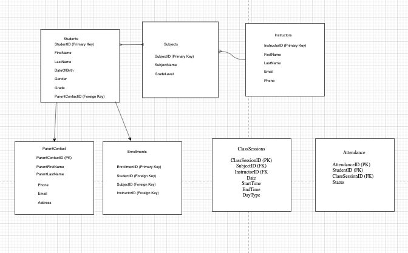
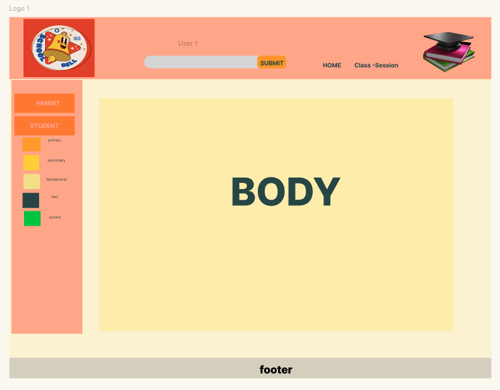

# School Bell Management System

Welcome to the vibrant School Bell Management System! This application is designed to manage and track various aspects of a school, including students, instructors, class sessions, and more. It features a dynamic and vibrant UI, built using React for the frontend and Django for the backend.

## Table of Contents
- [Features](#features)
- [Installation](#installation)
- [Usage](#usage)
- [Frontend Structure](#frontend-structure)
- [Backend Structure](#backend-structure)
- [API Endpoints](#api-endpoints)
- [Contributing](#contributing)
- [License](#license)

## Features
- **Dynamic Header**: Includes a search bar, user menu, and login form.
- **Functional Sidebar**: Provides navigation to various sections such as Students and Parents.
- **CRUD Functionality**: Manage students, instructors, class sessions, and more.
- **Responsive Design**: Ensures a great user experience on both desktop and mobile devices.
- **Authentication**: Simple login functionality for users.

## Installation

### Prerequisites
- Node.js
- npm (Node Package Manager)
- Python
- Django

### Backend Installation
1. Clone the repository:
   ```sh
   git clone https://github.com/graceCanCod3/AttendanceTracker.git
   cd AttendanceTracker

2. Set up the virtual environment and install dependencies:  
    ```sh
     brew install pipenv
     pipenv shell
     pipenv install django
     pipenv install psycopg2-binary
     pipenv run django-admin startproject 
     django-admin startapp

3. Apply migrations and create a superuser:
   ```sh
   python3 manage.py makemigrations
   python3 manage.py migrate
   python3 manage.py createsuperuser

4. Start the Django development server:
   ```sh
   python manage.py runserver


 
 ## ERD


 ## WireFrame



